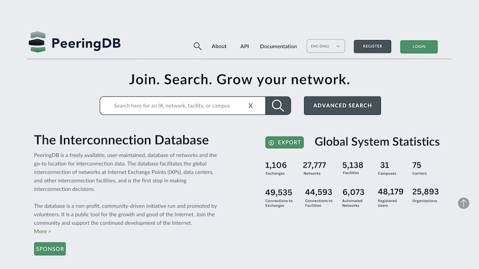
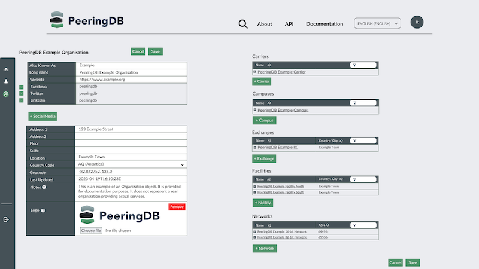

# PeeringDB Website Update

Our website design will be changing. But it's not going to be a radical change. There are two key objectives:

1. Take advantage of larger screens on laptops and desktops
2. Be more mobile friendly

We’ve been using Google Analytics to better understand our users for a year now. We know that one in five users is using a phone and those on laptops tend to have wide screens.

Meanwhile, we have added new columns to tables over time. For instance, you can now show if you peer with route servers or support BFD. This all takes up screen space.

In some situations, the density of information has led to some elements obscuring others. One example is long IPv6 addresses being obscured.

We have started rolling out the new website design to PeeringDB volunteers. This has been a success in generating usable feedback. We will update the design before taking the next rollout step: opting in a fifth of logged in users. 

We will randomly select users to be opted into the new design. But users who dislike the new design – or just don't want to be part of testing – can opt out by selecting Legacy under Select UI Version in their profile.

We will also be creating a new feature that allows users to volunteer to test new website features in the future.

## Next steps

We are now designing and deploying fixes for the issues raised by PeeringDB volunteer testers. When these are ready, we’ll roll out the new design to 20% of users.

We expect there will be another round of refinements and then we’ll deploy the new design to everyone.

This first round of changes focuses on search. The next round will focus on changes intended to help users manage their data. We’ll deploy new designs for managing your own profile and managing the resources owned by any organizations you are an admin for.

Of course, we’ll continue to adapt the site to meet users’ needs. We’ll let users who want to, opt-in to an early testing group. Everyone else can wait for early adopters to identify any refinements needed before everyone gets new features.

If you have an idea to improve PeeringDB you can share it on our low traffic [mailing lists](https://docs.peeringdb.com/#mailing-lists) or create an issue directly on [GitHub](https://github.com/peeringdb/peeringdb/issues). If you find a data quality issue, please let us know at [support@peeringdb.com](mailto:support@peeringdb.com).

--- 

PeeringDB is a freely available, user-maintained, database of networks, and the go-to location for interconnection data. The database facilitates the global interconnection of networks at Internet Exchange Points (IXPs), data centers, and other interconnection facilities, and is the first stop in making interconnection decisions.
